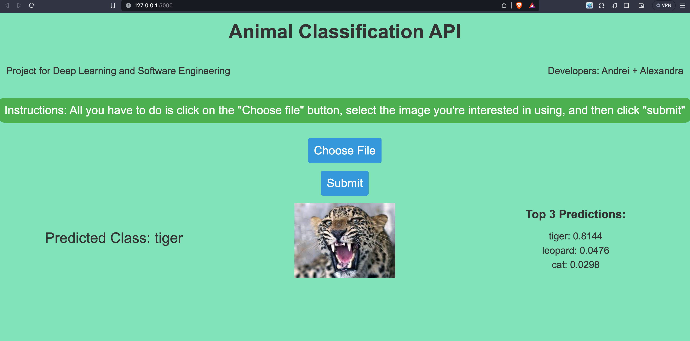

# Animal Classification API

## Overview

This project is an Animal Classification API developed as part of a Deep Learning and Software Engineering course. The API allows users to upload an image, and it predicts the class of the animal present in the image along with the probability of the prediction.

The model behind it has ResNet-50 at its core with ImageNet weights. Using transfer-learning, we trained a new model, having a few extra layers on top of the base model, on the [Animal Image Dataset (90 Different Animals)](https://www.kaggle.com/datasets/iamsouravbanerjee/animal-image-dataset-90-different-animals/data)

The final model was trained for 70 epochs, using Adam and a learning rate of 0.00001. The validation accuracy obtained was 75% (percentage of times when number one prediction matched the animal class it was inferring) and the top 3 categorical accuracy was 85% (the percentage of times when the correct prediction was in the first 3 predictions made).

## Instructions

### Getting Started

1. Clone this repository to your local machine.

   ```bash
   git clone [https://github.com/andrew-smalls/animal-classification-api.git]
   cd animal-classification-api

2. Download trained model, class labels and a few test image examples from [here](https://drive.google.com/file/d/1z30itdhVJTkgP_YIHzRWRMyWxQzLRdCI/view?usp=sharing) 
- extract the contents of the archive inside the animal-classification-api directory
- the model.h5 and class_indices.json will be used by the program
- the test_images_for_api directory is for the user (you can choose images from here to test how the model behaves, or you can test the API by using your own images)
- the folder structure should look like this:

```
animal-classification-api/
|-- main.py
|-- static/
|   |-- styles.css
|-- templates/
|   |-- index.html
|-- model.h5
|-- class_indices.json
...
...
...
|-- some other files 
```
3. Install required dependencies

Open a terminal inside the animal-classification-api and run the command:

```
pip install -r requirements.txt
```

4. Run the application
```
flask run
```
Assuming every dependency was installed and the required files are in the corresponding directory, the application will start on `localhost:5000`



